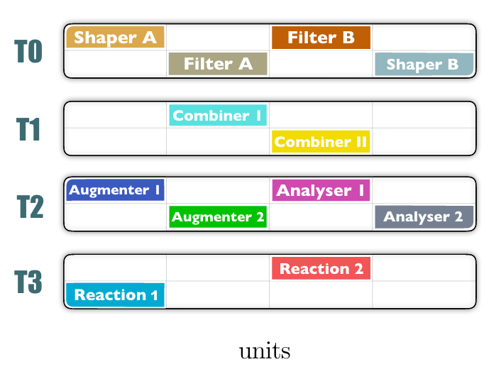

Architecture intro here

# Tiers
AMPEL is made of four execution layers (tiers) that replace a traditional pipeline architecture.

The tiers are independently scheduled and the information exchange between tiers occurs via a dedicated database.
The execution layer architecture along with the database structure allow for simple parallelization.

# Units
Each tier is modular and executes so-called "units".

Ampel _base units_ have standardized inputs and ouputs, enforced through abstract classes which units inherit.

# Processes

Every change in AMPEL is triggered by a _process_.
A process executes, at a given date and time, a _processor unit_ that itself runs one or multiple _base units_ with specific configurations.
Information about process executions are registred into the database.
The majority of processes are associated with a specific tier but general processes are possible.

A working AMPEL system will spawn multiple processes, posssibly concurently, accross the four AMPEL tiers.
This will result in the ingestion and analysis of data and the triggering of automated reactions when given data states are detected.

# Channels

_Channels_ are convenient for multi-user or multi-prupose AMPEL systems.
They allow to define and enforce access rights and to privatize processes,
meaning that the output generated by the processes will be only accessible to processes
belonging to the same channel.

Internally, _channels_ are just tags in database documents and ampel configuration files.  
From a user perspective, a channel can be seen as a collection of private processes.

 
Processes associated with a given channel

Note that within AMPEL, different _channels_ requiring the same computation
will not result in the required computation being performed twice.
